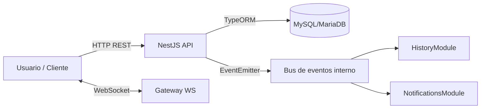
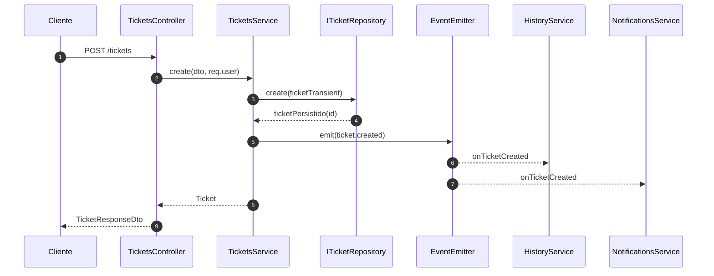

# Arquitectura

## Objetivo

API de tickets (NestJS) con separación estricta de capas:

- **Dominio puro** (entidades, value objects y eventos) sin dependencias de NestJS/TypeORM.
- **Aplicación** (services) con reglas de negocio y emisión de eventos.
- **Infraestructura** (TypeORM o in-memory) conectada mediante **puertos** (interfaces).

## Tecnologías

- **Node.js + TypeScript**
- **NestJS** (módulos, controllers, DI)
- **Swagger** (`@nestjs/swagger`) en `/api/docs`
- **Auth**: JWT + Passport (`@nestjs/jwt`, `passport-jwt`)
- **RBAC**: Guards + decorador `@Roles`
- **Eventos internos**: `@nestjs/event-emitter`
- **WebSockets**: `@nestjs/websockets` + `socket.io`
- **MySQL/MariaDB** + **TypeORM** (`typeorm`, `mysql2`) en infraestructura

## Vista general (Contexto)



## Capas (Clean/Hexagonal)

```mermaid
flowchart TB
  subgraph Delivery[Delivery]
    C[Controllers
src/modules/*/*.controller.ts]
  end

  subgraph Application[Aplicación]
    S[Services
src/modules/*/*.service.ts]
  end

  subgraph Ports[Puertos]
    P1[IUserRepository]
    P2[ITicketRepository]
    P3[IHistoryRepository]
    P4[INotificationRepository]
  end

  subgraph Domain[Dominio]
    D1[Entidades/VO/Eventos
src/domain/**]
  end

  subgraph Infra[Infraestructura]
    IM[Repos In-Memory
src/infrastructure/persistence/in-memory/**]
    ORM[Repos MySQL (TypeORM)
src/infra/database/typeorm/**]
  end

  C --> S
  S --> D1
  S --> P1
  S --> P2
  S --> P3
  S --> P4
  P1 --> IM
  P2 --> IM
  P3 --> IM
  P4 --> IM
  P1 --> ORM
  P2 --> ORM
  P3 --> ORM
  P4 --> ORM
```

## Módulos funcionales

- `AuthModule`: login JWT y guards
- `UsersModule`: alta de usuarios y endpoint `me`
- `TicketsModule`: crear/listar/asignar/cambiar estado
- `HistoryModule`: listener de eventos → escribe historial
- `NotificationsModule`: listener de eventos → notifica por WS/logs
- `ReportsModule`: stub/placeholder

## Flujo de ejemplo: crear ticket



## IDs y tipos (decisión clave)

- El **DDL** define `AUTO_INCREMENT` en MySQL/MariaDB.
- El dominio y la capa de aplicación trabajan con **IDs numéricos (`number`)**.
- Los controladores permanecen intactos: reciben parámetros `string` (por URL) y la capa de aplicación los parsea.
- La respuesta pública mantiene IDs como `string` (mappers de API).

## Roles (DB multi-rol vs dominio)

- La DB soporta **múltiples roles por usuario** mediante `usuario_rol`.
- El dominio expone actualmente **un rol principal** (`UserRole`).
- El mapper de infraestructura elige el rol principal por prioridad (ADMIN > AGENT > CLIENT).

> Si más adelante quieres exponer una colección de roles en dominio/API, se puede extender sin tocar el esquema.

## Estructura técnica (carpetas principales)

```text
src/
  app.module.ts
  main.ts
  common/                 (guards, decorators, interceptors, filters)
  config/                 (validación env, configs)
  domain/                 (puro: entidades/VO/eventos)
  interfaces/             (puertos: contratos de repos)
  modules/                (controllers + services por caso de uso)
  infra/
    database/typeorm/     (entidades ORM, mappers, repos TypeORM, datasource)
  infrastructure/
    persistence/          (switch in-memory vs mysql)
      in-memory/          (adaptadores de memoria)
```

