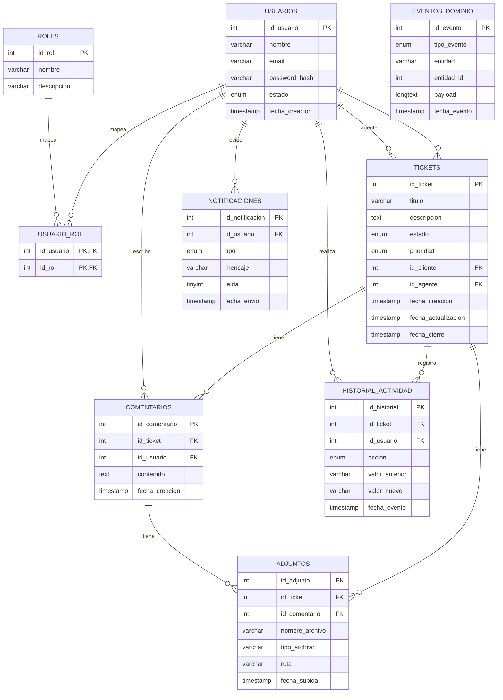

# Base de datos y persistencia

## Fuente de verdad (DDL)

El esquema oficial está en:

- [database/ddl_gestion_tickets.sql](../database/ddl_gestion_tickets.sql)

Características del DDL:

- MariaDB/MySQL
- InnoDB
- `utf8mb4_unicode_ci`
- IDs `INT AUTO_INCREMENT`
- Enums estrictos:
  - `tickets.estado`: `OPEN | IN_PROGRESS | CLOSED`
  - `tickets.prioridad`: `LOW | MEDIUM | HIGH`
  - `usuarios.estado`: `ACTIVO | INACTIVO`
  - `historial_actividad.accion`: `CREADO | ASIGNADO | REASIGNADO | CAMBIO_ESTADO | COMENTARIO | CIERRE`
  - `notificaciones.tipo`: `EMAIL | WEBSOCKET | LOG`
  - `eventos_dominio.tipo_evento`: `TICKET_CREATED | TICKET_ASSIGNED | TICKET_STATUS_CHANGED`

## Modelo relacional (ERD)



## Implementación en código

### Entidades ORM (TypeORM)

Ubicación:

- [src/infra/database/typeorm/entities](../src/infra/database/typeorm/entities)

Principios:

- Las entidades ORM reflejan nombres/columnas del DDL (`id_ticket`, `id_usuario`, etc.).
- El dominio no conoce TypeORM.

### Repositorios MySQL (TypeORM)

Ubicación:

- [src/infra/database/typeorm/repositories](../src/infra/database/typeorm/repositories)

Estos repositorios implementan los puertos de:

- [src/interfaces/repositories](../src/interfaces/repositories)

### Selección del driver (in-memory vs mysql)

La selección se hace con `PERSISTENCE_DRIVER` en:

- [src/infrastructure/persistence/persistence.module.ts](../src/infrastructure/persistence/persistence.module.ts)

Valores:

- `in-memory` (por defecto)
- `mysql`

## Migraciones

Este proyecto usa TypeORM **solo en infraestructura** para dos cosas:

1) Mapear entidades/repositorios MySQL
2) Ejecutar migraciones versionadas (principalmente triggers de auditoría)

Los scripts TypeORM están en `package.json`:

- `npm run migration:run`
- `npm run migration:revert`
- `npm run migration:generate`

El DataSource para CLI:

- [src/infra/database/typeorm/typeorm.datasource.ts](../src/infra/database/typeorm/typeorm.datasource.ts)

> Nota: el **DDL** crea tablas. Las **migraciones TypeORM** se usan para cambios incrementales (por ejemplo, triggers) con rollback.

## Triggers (auditoría)

Objetivo (diseño):

- Insertar filas en `historial_actividad` y `eventos_dominio` ante:
  - creación de ticket
  - asignación/reasignación
  - cambio de estado

Estrategia recomendada:

- Aplicar el DDL como “baseline” (manual o por pipeline): [../database/ddl_gestion_tickets.sql](../database/ddl_gestion_tickets.sql)
- Ejecutar migraciones TypeORM del proyecto (crean/borran triggers):
  - [../src/infra/database/typeorm/migrations/1700000000000-baseline-ddl.ts](../src/infra/database/typeorm/migrations/1700000000000-baseline-ddl.ts)
  - [../src/infra/database/typeorm/migrations/1700000000100-audit-triggers.ts](../src/infra/database/typeorm/migrations/1700000000100-audit-triggers.ts)

### Setup sugerido (MySQL/MariaDB)

1) Crear la base `ticketing_system` y aplicar el DDL.
2) Configurar `.env` (ver [../.env.example](../.env.example)) y usar `PERSISTENCE_DRIVER=mysql`.
3) Ejecutar:

```bash
npm run migration:run
```

### Verificación rápida (auditoría)

Después de crear/actualizar tickets y agregar comentarios, valida que se inserten filas:

```sql
SELECT *
FROM historial_actividad
ORDER BY fecha_evento DESC
LIMIT 50;

SELECT *
FROM eventos_dominio
ORDER BY fecha_evento DESC
LIMIT 50;
```

Si quieres inspeccionar triggers instalados:

```sql
SHOW TRIGGERS LIKE 'tickets';
SHOW TRIGGERS LIKE 'comentarios';
```

